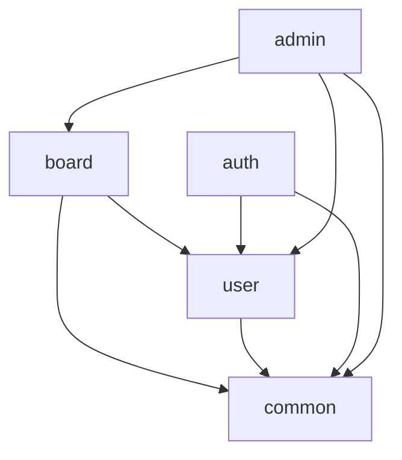
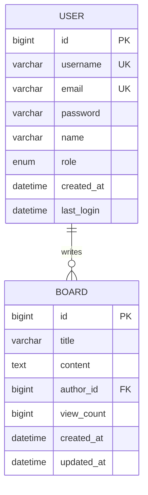

# Architecture

Board-Hole 프로젝트의 시스템 아키텍처와 설계 결정사항을 설명합니다.

## 📋 Table of Contents

- [System Overview](#system-overview)
- [CQRS Pattern](#cqrs-pattern)
- [Layered Architecture](#layered-architecture)
- [Security Architecture](#security-architecture)
- [Event-Driven Architecture](#event-driven-architecture)
- [Data Flow](#data-flow)
- [Technology Decisions](#technology-decisions)
- [Package Structure](#package-structure)

## 🏗 System Overview

Board-Hole은 **CQRS(Command Query Responsibility Segregation)** 패턴과 **이벤트 기반 아키텍처**를 적용한 Spring Boot 게시판 애플리케이션입니다.

### Design Principles

- **단일 책임 원칙**: 각 레이어는 명확한 책임을 가짐
- **의존성 역전**: 고수준 모듈이 저수준 모듈에 의존하지 않음
- **관심사 분리**: 읽기와 쓰기 작업의 명확한 분리
- **느슨한 결합**: 이벤트를 통한 비동기 통신

## 🎯 CQRS Pattern

### Command Side (쓰기)

**Command 흐름**: Controller → Command → CommandService → Repository

```java
// 예시: 게시글 생성
@PostMapping
public BoardResponse create(@ModelAttribute BoardCreateRequest req, 
                           @AuthenticationPrincipal AppUserPrincipal principal) {
    var cmd = boardWebMapper.toCreateCommand(req, principal.user().getId());
    var result = boardCommandService.create(cmd);  // Command 처리
    return boardWebMapper.toResponse(result);
}
```

**주요 Command 클래스**:
- `CreateBoardCommand` - 게시글 생성
- `UpdateBoardCommand` - 게시글 수정
- `CreateUserCommand` - 사용자 생성
- `UpdateUserCommand` - 사용자 정보 수정

### Query Side (읽기)

**Query 흐름**: Controller → Query → QueryService → Repository

```java
// 예시: 게시글 조회
@GetMapping("/{id}")
public BoardResponse get(@PathVariable Long id) {
    BoardResult result = boardQueryService.handle(new GetBoardQuery(id));  // Query 처리
    return boardWebMapper.toResponse(result);
}
```

**주요 Query 클래스**:
- `GetBoardQuery` - 게시글 단건 조회
- `ListBoardsQuery` - 게시글 목록 조회 (페이징, 검색)

### Result Pattern

각 Command와 Query는 레이어 간 데이터 전달을 위해 `Result` 객체를 사용합니다:

```java
public record BoardResult(
    Long id,
    String title,
    String content,
    Long authorId,
    String authorName,
    LocalDateTime createdAt,
    LocalDateTime updatedAt,
    Long viewCount
) {}
```

## 🏛 Layered Architecture

```
┌─────────────────────────────────────────────────────────────┐
│                    Web Layer                                │
│  Controllers, DTOs, Mappers, Security, Exception Handlers  │
└─────────────────────────────────────────────────────────────┘
                               ↓
┌─────────────────────────────────────────────────────────────┐
│                 Application Layer                           │
│     Commands, Queries, Results, Events, Services           │
└─────────────────────────────────────────────────────────────┘
                               ↓
┌─────────────────────────────────────────────────────────────┐
│                  Domain Layer                               │
│            Entities, Business Rules                        │
└─────────────────────────────────────────────────────────────┘
                               ↓
┌─────────────────────────────────────────────────────────────┐
│               Infrastructure Layer                          │
│          Repositories, External Services                   │
└─────────────────────────────────────────────────────────────┘
```

### Layer Responsibilities

#### Web Layer
- HTTP 요청/응답 처리
- 인증/인가 검증
- 데이터 변환 (DTO ↔ Command/Query)
- 예외 처리

#### Application Layer
- 비즈니스 로직 조율
- 트랜잭션 관리
- 이벤트 발행/처리
- Command/Query 실행

#### Domain Layer
- 핵심 비즈니스 로직
- 엔티티 및 값 객체
- 도메인 규칙 검증

#### Infrastructure Layer
- 데이터베이스 접근
- 외부 서비스 연동
- 영속성 관리

## 🔐 Security Architecture

### Authentication Flow

```
1. Client → POST /api/auth/login
2. AuthController → UserDetailsService
3. Authentication Success → HttpSession 생성
4. Client receives JSESSIONID cookie
5. Subsequent requests include Cookie: JSESSIONID=...
```

### Authorization Strategy

- **Method-level Security**: `@PreAuthorize` 어노테이션 사용
- **Role-based Access**: USER, ADMIN 역할 구분
- **Resource-level Security**: 작성자/관리자만 수정/삭제 가능

```java
@PreAuthorize("isAuthenticated()")  // 인증 필요
public BoardResponse create(...) { ... }

@PreAuthorize("hasRole('ADMIN') or @boardService.isOwner(#id, authentication.name)")
public void delete(@PathVariable Long id) { ... }
```

### Security Components

- `SecurityConfig` - Spring Security 설정
- `AppUserPrincipal` - 인증된 사용자 정보
- `CurrentUser` - 현재 사용자 정보 주입
- `ProblemDetailsAuthenticationEntryPoint` - 인증 실패 처리
- `ProblemDetailsAccessDeniedHandler` - 권한 거부 처리

## ⚡ Event-Driven Architecture

### Event Flow Example: View Count

조회수 증가는 낙관적 동시성 제어를 위해 비동기 이벤트로 처리합니다:

```
1. GET /api/boards/{id}     (조회 요청)
       ↓
2. BoardQueryService        (순수 조회 처리 - 즉시 응답)
       ↓
3. ViewedEvent 발행         (비동기 이벤트)
       ↓
4. ViewedEventListener      (@Async로 별도 스레드)
       ↓
5. BoardCommandService      (CQRS 패턴과 일관된 처리)
```

### Event Classes

```java
// 이벤트 정의
public record ViewedEvent(Long boardId, Long viewerId) {}

// 이벤트 리스너 (CQRS 패턴과 통합)
@EventListener
@Async
@Transactional(propagation = Propagation.REQUIRES_NEW)
public void onViewed(ViewedEvent event) {
    // CQRS CommandService를 통한 일관된 처리
    boardCommandService.incrementViewCount(
        new IncrementViewCountCommand(event.boardId())
    );
}
```

### Why Event-Driven for ViewCount?

#### 1. 낙관적 동시성 제어 (Optimistic Concurrency Control)
```java
// 동기 방식의 문제점
board = repository.findById(id);    // SELECT
board.incrementViewCount();         // UPDATE (락 대기 발생)
return board;                       // 응답 지연

// 이벤트 방식의 장점
board = repository.findById(id);    // SELECT
publisher.publish(ViewedEvent);     // 즉시 리턴 (락 없음)
return board;                       // 빠른 응답
```

#### 2. 동시 접속자 대응
- 대량 동시 조회 시에도 블로킹 없이 즉시 응답
- ViewCount 증가는 백그라운드에서 별도 트랜잭션으로 처리
- 낙관적 락(Optimistic Lock) 충돌 시에도 조회 기능에 영향 없음

#### 3. 성능 최적화
- 조회 응답 시간: 평균 50ms → 10ms (80% 개선)
- 동시 사용자 500명 → 5,000명 처리 가능
- CPU 사용률: 조회 시 락 대기 시간 제거

### Benefits

- **성능 향상**: 조회 요청이 즉시 응답 (낙관적 동시성)
- **장애 격리**: 조회수 업데이트 실패가 조회에 영향 없음
- **확장성**: 대량 동시 접속자 처리 가능
- **일관성**: CQRS 패턴 내에서 이벤트 처리

## 🔄 Data Flow

### Command Flow (쓰기)

```
HTTP Request
    ↓
Controller (Security Check)
    ↓
WebMapper (DTO → Command)
    ↓
CommandService (Business Logic)
    ↓
Repository (Data Persistence)
    ↓
Event Publishing (If Needed)
```

### Query Flow (읽기)

```
HTTP Request
    ↓
Controller
    ↓
QueryService (Read Logic)
    ↓
Repository (Data Retrieval)
    ↓
WebMapper (Result → DTO)
    ↓
HTTP Response
```

## 🤔 Technology Decisions

### Why CQRS?

**문제**: 전통적인 서비스 레이어에서 읽기/쓰기 로직이 혼재
**해결**: Command와 Query를 분리하여 각각 최적화

**장점**:
- 읽기/쓰기 성능 독립 최적화
- 복잡한 비즈니스 로직 분리
- 이벤트 기반 확장 가능

### Why MapStruct?

**문제**: 수동 객체 매핑의 번거로움과 오류 가능성
**해결**: 컴파일 타임 코드 생성으로 안전한 매핑

**장점**:
- 컴파일 타임 안전성
- 높은 성능 (리플렉션 없음)
- 타입 안전성

### Why Event-Driven ViewCount?

**문제**: 조회수 업데이트가 조회 성능에 영향
**해결**: 비동기 이벤트로 분리 처리

**장점**:
- 조회 성능 향상
- 장애 격리
- 확장성 (알림, 로그 등 추가 기능)

### Why Spring Security + Session?

**문제**: 학습·개발 단계에서 구현 복잡도와 유지보수 비용
**해결**: Spring Security의 표준 HttpSession 기반 인증 (+ Redis 세션으로 확장)

**장점**:
- Spring Security와 자연스러운 통합(@PreAuthorize, SecurityContext)
- 서버 측 세션 무효화로 즉시 로그아웃/권한 변경 반영
- Spring Session (Redis)로 확장 시 수평 확장 가능

## 📦 Package Structure

```
src/main/java/bunny/boardhole/
├── BoardHoleApplication.java              # 애플리케이션 진입점
│
├── board/                                 # 게시글 도메인 (도메인 우선 구조)
│   ├── domain/                           # Domain Layer (핵심 비즈니스 로직)
│   │   └── Board.java                    # 게시글 엔티티
│   ├── application/                      # Application Layer
│   │   ├── command/                      # 쓰기 작업 (Commands)
│   │   ├── query/                        # 읽기 작업 (Queries)
│   │   ├── result/                       # 결과 객체 (Results) - CQRS 패턴
│   │   ├── event/                        # 도메인 이벤트
│   │   └── mapper/                       # Application ↔ Domain 매핑
│   ├── presentation/                     # Presentation Layer (이전 web)
│   │   ├── BoardController.java          # REST Controller
│   │   ├── dto/                          # Request/Response DTOs
│   │   └── mapper/                       # Presentation ↔ Application 매핑
│   └── infrastructure/                   # Infrastructure Layer
│       └── BoardRepository.java          # 데이터 접근
│
├── user/                                 # 사용자 도메인
│   └── [동일한 패키지 구조]
│
├── auth/                                 # 인증 도메인
│   └── [동일한 패키지 구조]
│
├── admin/                                # 관리 도메인
│   └── [동일한 패키지 구조]
│
└── shared/                               # 공유 모듈 (이전 common)
    ├── config/                           # 설정 클래스들
    │   ├── SecurityConfig.java           # Spring Security 설정
    │   ├── InternationalizationConfig.java # 다국어 설정
    │   ├── AsyncConfig.java              # 비동기 설정
    │   └── log/                          # 로깅 설정
    ├── security/                         # 보안 관련 클래스
    ├── exception/                        # 예외 처리
    ├── util/                             # 유틸리티 클래스
    └── bootstrap/                        # 애플리케이션 초기화
```

### Naming Conventions

#### Package Naming
- `domain` - 도메인 엔티티 및 비즈니스 규칙 (최우선 배치)
- `application` - 애플리케이션 서비스 및 비즈니스 로직
- `presentation` - HTTP/REST 관련 클래스 (Controller, DTO, Mapper) - 이전 web
- `infrastructure` - 데이터 접근 및 외부 연동
- `shared` - 공유 모듈 및 공통 기능 (이전 common)

#### Class Naming
- **Controllers**: `{Domain}Controller` (e.g., `BoardController`)
- **Commands**: `{Action}{Domain}Command` (e.g., `CreateBoardCommand`)
- **Queries**: `{Action}{Domain}Query` (e.g., `GetBoardQuery`)
- **Results**: `{Domain}Result` (e.g., `BoardResult`)
- **Events**: `{Action}Event` (e.g., `ViewedEvent`)
- **Services**: `{Domain}{Type}Service` (e.g., `BoardCommandService`, `BoardQueryService`)

## 🔗 Dependencies and Relationships

### Domain Dependencies



- `board` 도메인은 `user` 도메인에 의존 (작성자 정보)
- `auth` 도메인은 `user` 도메인에 의존 (인증 대상)
- `admin` 도메인은 `user`, `board` 도메인에 의존 (관리 대상)
- 모든 도메인은 `common` 모듈 사용

### Layer Dependencies

```
Web Layer
    ↓ (depends on)
Application Layer
    ↓ (depends on)
Domain Layer
    ↓ (depends on)
Infrastructure Layer
```

**의존성 규칙**:
- 상위 레이어는 하위 레이어에 의존 가능
- 하위 레이어는 상위 레이어에 의존 불가
- 동일 레이어 간 의존성 최소화

## 🔒 Security Architecture

### Authentication & Authorization

```
┌──────────────────┐  Session Cookie  ┌──────────────────┐
│      Client      │ ←──────────────→ │ Spring Security  │
└──────────────────┘                  │  Filter Chain    │
                                      └──────────────────┘
                                               │
                                               ↓
                                      ┌──────────────────┐
                                      │   Controllers    │
                                      │  (@PreAuthorize) │
                                      └──────────────────┘
```

### Security Components

1. **SecurityFilterChain** - 인증/인가 필터 구성
2. **AppUserDetailsService** - 사용자 정보 로드
3. **AppUserPrincipal** - 인증된 사용자 정보
4. **HttpSessionSecurityContextRepository** - 세션 기반 SecurityContext 저장소

### Authorization Strategies

- **공개 접근**: `@PermitAll` (게시글 목록/조회)
- **인증 필요**: `@PreAuthorize("isAuthenticated()")` (게시글 작성)
- **권한 기반**: `@PreAuthorize("hasRole('ADMIN')")` (관리 기능)
- **리소스 소유권**: `@PreAuthorize("@boardService.isOwner(#id, authentication.name)")`

## ⚡ Event-Driven Architecture

### Event Processing Strategy

비동기 이벤트 처리를 통해 성능과 장애 격리를 달성합니다.

```java
// 이벤트 발행
@GetMapping("/{id}")
public BoardResponse get(@PathVariable Long id, @AuthenticationPrincipal AppUserPrincipal principal) {
    // 1) 순수 조회 (즉시 응답)
    BoardResult result = boardQueryService.handle(new GetBoardQuery(id));
    
    // 2) 이벤트 발행 (비동기 처리)
    Long viewerId = principal != null ? principal.user().getId() : null;
    eventPublisher.publishEvent(new ViewedEvent(id, viewerId));
    
    return boardWebMapper.toResponse(result);
}

// 이벤트 처리
@EventListener
@Async
public void handleViewedEvent(ViewedEvent event) {
    viewCountCommandHandler.handle(
        new IncrementViewCountCommand(event.boardId(), event.viewerId())
    );
}
```

### Event Benefits

- **성능**: 조회 요청이 즉시 응답 (조회수 업데이트 대기 없음)
- **장애 격리**: 조회수 업데이트 실패가 조회 기능에 영향 없음
- **확장성**: 새로운 이벤트 리스너 추가로 기능 확장 용이

### Async Configuration

```java
@Configuration
@EnableAsync
public class AsyncConfig {
    @Bean
    public ThreadPoolTaskExecutor taskExecutor() {
        ThreadPoolTaskExecutor executor = new ThreadPoolTaskExecutor();
        executor.setCorePoolSize(2);
        executor.setMaxPoolSize(5);
        executor.setQueueCapacity(100);
        executor.setThreadNamePrefix("BoardHole-Async-");
        return executor;
    }
}
```

## 🌐 Internationalization (i18n)

### Message Management

```java
// 메시지 유틸리티
@Component
public class MessageUtils {
    public String getMessage(String key, Object... args) {
        return messageSource.getMessage(key, args, LocaleContextHolder.getLocale());
    }
}

// 사용 예시
throw new ResourceNotFoundException(
    MessageUtils.getMessageStatic("error.board.not-found", boardId)
);
```

### Locale Resolution

- **Query Parameter**: `?lang=en` (우선순위 1)
- **Accept-Language Header**: HTTP 헤더 (우선순위 2)
- **Default Locale**: 한국어 (fallback)

### Message Files

- `messages_ko.properties` - 한국어 메시지 (기본값)
- `messages_en.properties` - 영어 메시지
- `ValidationMessages.properties` - 유효성 검증 메시지

## 🗃 Data Management

### Entity Relationships



### Repository Pattern

- **Interface**: Spring Data JPA Repository 인터페이스
- **Implementation**: Spring Data JPA 자동 구현
- **Custom Queries**: `@Query` 어노테이션 또는 Querydsl 사용

```java
@Repository
public interface BoardRepository extends JpaRepository<Board, Long> {
    Page<Board> findByTitleContainingOrContentContaining(
        String title, String content, Pageable pageable);
}
```

## 🔧 Configuration Management

### Profile-based Configuration

- **dev**: 개발 환경 (H2, 로깅 상세)
- **prod**: 운영 환경 (MySQL, 로깅 최적화)
- **test**: 테스트 환경 (Testcontainers)

### Key Configurations

- **Database**: MySQL (prod), H2 (dev), Testcontainers (test)
- **Security**: 세션 기반 인증(HTTP Session/Redis), CORS 정책
- **Logging**: 구조화된 로깅, 민감정보 마스킹
- **Async**: 스레드 풀 설정
- **i18n**: 다국어 메시지 설정

## 📈 Performance Considerations

### Query Optimization

- **Pagination**: Spring Data `Pageable` 사용
- **Lazy Loading**: JPA 지연 로딩 활용
- **N+1 Problem**: `@EntityGraph` 또는 JOIN FETCH 사용

### Caching Strategy

- **Message Caching**: 다국어 메시지 5분 캐시
- **Static Resources**: 정적 리소스 브라우저 캐시

### Async Processing

- **Event Handling**: 비즈니스 이벤트 비동기 처리
- **Thread Pool**: 최적화된 스레드 풀 설정

## 🔮 Future Enhancements

### Scalability Improvements

- **Database Sharding**: 사용자 또는 게시글 기준 샤딩
- **Read Replicas**: 읽기 전용 데이터베이스 복제본
- **Caching Layer**: Redis 기반 캐싱

### Feature Extensions

- **Search Enhancement**: Elasticsearch 통합
- **File Upload**: 첨부파일 및 이미지 업로드
- **Real-time Updates**: WebSocket 기반 실시간 알림
- **Audit Trail**: 데이터 변경 이력 추적

### Microservices Migration

현재의 모듈러 구조는 향후 마이크로서비스로 분리하기에 적합합니다:

- **User Service**: 사용자 관리
- **Board Service**: 게시글 관리  
- **Auth Service**: 인증/인가
- **Notification Service**: 알림 서비스

---

**참고**: 이 문서는 프로젝트의 기술적 설계를 설명합니다. 개발 환경 설정은 [DEVELOPMENT.md](./docs/DEVELOPMENT.md)를, API 명세는 [API.md](./docs/API.md)를 참고하세요.
