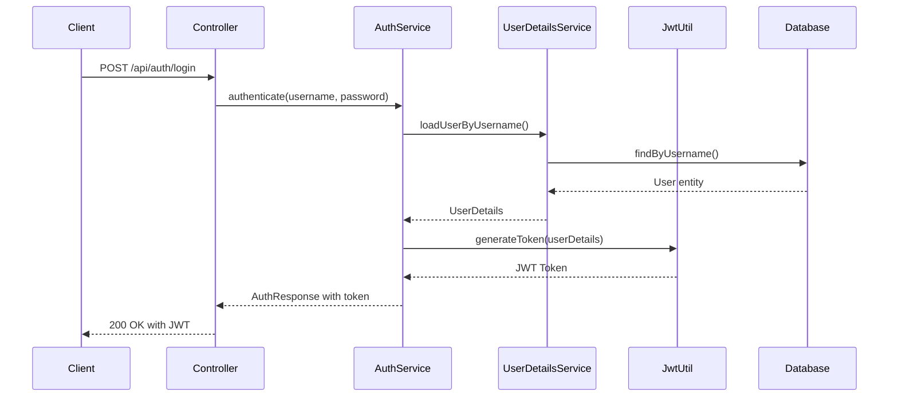

# Security Policy

Board-Hole 프로젝트의 보안 정책과 취약점 보고 절차를 설명합니다.

## 🛡️ Security Overview

Board-Hole은 교육용 프로젝트이지만, 실제 환경에서 사용할 수 있는 보안 모범 사례를 구현합니다.

## 📋 Table of Contents

- [Supported Versions](#-supported-versions)
- [Security Features](#-security-features)
- [Authentication & Authorization](#-authentication--authorization)
- [Input Validation](#-input-validation)
- [Security Headers](#-security-headers)
- [Reporting Vulnerabilities](#-reporting-vulnerabilities)
- [Security Best Practices](#-security-best-practices)

## 📅 Supported Versions

| Version | Supported | Status |
|---------|-----------|---------|
| 1.x.x   | ✅ | Active development |
| 0.x.x   | ❌ | No longer supported |

## 🔒 Security Features

### Core Security Components

- **🔐 JWT Authentication**: Stateless token-based authentication
- **👤 Spring Security Integration**: Comprehensive security framework
- **🛡️ Role-based Access Control (RBAC)**: USER/ADMIN 역할 구분
- **🌐 Internationalized Error Messages**: 다국어 보안 에러 메시지
- **🔍 Input Validation**: Bean Validation과 custom validators
- **🚫 CORS Protection**: Cross-Origin Resource Sharing 설정
- **🔒 Password Security**: 안전한 비밀번호 저장 (BCrypt)

## 🔑 Authentication & Authorization

### Authentication Flow



### Security Configuration

```java
@Configuration
@EnableWebSecurity
@EnableMethodSecurity
public class SecurityConfig {
    
    @Bean
    public SecurityFilterChain filterChain(HttpSecurity http) throws Exception {
        return http
            .csrf(AbstractHttpConfigurer::disable)  // JWT 사용으로 CSRF 비활성화
            .sessionManagement(session -> session
                .sessionCreationPolicy(SessionCreationPolicy.STATELESS))  // 무상태
            .authorizeHttpRequests(auth -> auth
                .requestMatchers("/api/auth/**").permitAll()  // 인증 엔드포인트 공개
                .requestMatchers(HttpMethod.GET, "/api/boards/**").permitAll()  // 조회 공개
                .anyRequest().authenticated())  // 나머지는 인증 필요
            .oauth2ResourceServer(oauth2 -> oauth2.jwt(Customizer.withDefaults()))
            .exceptionHandling(ex -> ex
                .authenticationEntryPoint(problemDetailsAuthenticationEntryPoint())
                .accessDeniedHandler(problemDetailsAccessDeniedHandler()))
            .build();
    }
}
```

### Authorization Levels

#### Public Access (인증 불필요)
- `GET /api/boards` - 게시글 목록 조회
- `GET /api/boards/{id}` - 게시글 상세 조회
- `POST /api/auth/login` - 로그인
- `POST /api/users` - 사용자 회원가입

#### Authenticated Access (인증 필요)
- `POST /api/boards` - 게시글 작성
- `GET /api/auth/me` - 현재 사용자 정보
- `PUT /api/users/{id}` - 사용자 정보 수정 (본인만)

#### Resource-based Access (리소스 소유권)
- `PUT /api/boards/{id}` - 게시글 수정 (작성자 또는 관리자)
- `DELETE /api/boards/{id}` - 게시글 삭제 (작성자 또는 관리자)

#### Admin Access (관리자 권한)
- `GET /api/users` - 전체 사용자 목록
- `DELETE /api/users/{id}` - 사용자 삭제

### Method-level Security

```java
@RestController
public class BoardController {
    
    @PreAuthorize("isAuthenticated()")  // 인증된 사용자만
    public BoardResponse create(...) { }
    
    @PreAuthorize("hasRole('ADMIN') or @boardSecurityService.isOwner(#id, authentication.name)")
    public BoardResponse update(@PathVariable Long id, ...) { }  // 관리자 또는 작성자만
    
    @PermitAll  // 모든 사용자 허용
    public Page<BoardResponse> list(...) { }
}
```

## ✅ Input Validation

### Request Validation

Bean Validation과 custom validators를 사용하여 모든 입력값을 검증합니다:

```java
public class BoardCreateRequest {
    
    @NotBlank(message = "{validation.board.title.required}")
    @Size(max = 200, message = "{validation.board.title.size}")
    private String title;
    
    @NotBlank(message = "{validation.board.content.required}")
    @Size(max = 10000, message = "{validation.board.content.size}")
    private String content;
}

// 글로벌 validation 에러 처리
@RestControllerAdvice
public class GlobalExceptionHandler {
    
    @ExceptionHandler(MethodArgumentNotValidException.class)
    public ResponseEntity<ProblemDetail> handleValidation(MethodArgumentNotValidException ex) {
        // 유효성 검증 실패 처리
    }
}
```

### SQL Injection Prevention

- **JPA/Hibernate**: Parameterized queries 자동 사용
- **Repository Queries**: `@Query` with named parameters
- **동적 쿼리**: Querydsl 또는 Specification 사용 권장

```java
@Repository
public interface BoardRepository extends JpaRepository<Board, Long> {
    
    // ✅ Safe: Parameterized query
    @Query("SELECT b FROM Board b WHERE b.title LIKE %:keyword% OR b.content LIKE %:keyword%")
    Page<Board> findByKeyword(@Param("keyword") String keyword, Pageable pageable);
    
    // ❌ Unsafe: String concatenation (Don't do this)
    // @Query("SELECT b FROM Board b WHERE b.title LIKE '%" + keyword + "%'")
}
```

## 🛡️ Security Headers

Spring Security 기본 보안 헤더가 자동 적용됩니다:

```http
X-Content-Type-Options: nosniff
X-Frame-Options: DENY
X-XSS-Protection: 0
Strict-Transport-Security: max-age=31536000 ; includeSubDomains
Content-Security-Policy: default-src 'self'
```

### CORS Configuration

```java
@Configuration
public class WebConfig implements WebMvcConfigurer {
    
    @Override
    public void addCorsMappings(CorsRegistry registry) {
        registry.addMapping("/api/**")
            .allowedOrigins("http://localhost:3000", "http://localhost:8080")
            .allowedMethods("GET", "POST", "PUT", "DELETE", "OPTIONS")
            .allowedHeaders("*")
            .allowCredentials(true)
            .maxAge(3600);
    }
}
```

## 📊 Logging and Monitoring

### Security Event Logging

```java
@Component
@Slf4j
public class SecurityEventLogger {
    
    @EventListener
    public void handleAuthenticationSuccess(AuthenticationSuccessEvent event) {
        String username = event.getAuthentication().getName();
        log.info("🔓 Authentication successful for user: {}", username);
    }
    
    @EventListener  
    public void handleAuthenticationFailure(AbstractAuthenticationFailureEvent event) {
        String username = event.getAuthentication().getName();
        log.warn("🚫 Authentication failed for user: {}", username);
    }
}
```

### Sensitive Data Masking

로그에서 민감한 정보가 노출되지 않도록 마스킹 처리:

```java
@Component
public class LoggingAspect {
    
    @Around("@annotation(LogExecutionTime)")
    public Object logExecutionTime(ProceedingJoinPoint joinPoint) throws Throwable {
        String methodName = joinPoint.getSignature().getName();
        Object[] args = Arrays.stream(joinPoint.getArgs())
            .map(this::maskSensitiveData)  // 민감 데이터 마스킹
            .toArray();
            
        log.info("📥 Method started: {}({})", methodName, Arrays.toString(args));
        // ...
    }
    
    private Object maskSensitiveData(Object arg) {
        // password, token 등 민감 정보 마스킹
    }
}
```

## 🚨 Reporting Vulnerabilities

### How to Report

보안 취약점을 발견하셨나요? 다음 절차를 따라주세요:

1. **🔒 Private Report**: 공개 이슈가 아닌 비공개 보고
   - Email: [security@boardhole.com]
   - Subject: `[SECURITY] Brief description`

2. **📝 Include Information**:
   - 취약점 상세 설명
   - 재현 단계 (가능한 경우)
   - 영향도 평가
   - 제안 해결책 (선택사항)

3. **⏰ Response Timeline**:
   - 24시간 내: 수신 확인
   - 48시간 내: 초기 분석
   - 7일 내: 상세 조사 결과
   - 필요시: 패치 릴리스

### Responsible Disclosure

- **🤝 Coordinated disclosure**: 패치 완료 후 공개
- **🏆 Credit**: 기여자 인정 (원하는 경우)
- **📢 Security Advisory**: 심각한 취약점의 경우 보안 공지

## 🛠 Security Best Practices

### For Contributors

#### 코드 작성 시
- **🔐 Never hardcode secrets**: 비밀키, API키 하드코딩 금지
- **✅ Validate all inputs**: 모든 사용자 입력 검증
- **🚫 Avoid SQL injection**: Parameterized queries 사용
- **🔒 Secure defaults**: 보안 기본값 사용

#### 테스트 시
- **🧪 Security tests**: 인증/인가 테스트 포함
- **🔍 Boundary testing**: 경계값 및 악의적 입력 테스트
- **📊 Coverage**: 보안 관련 코드 테스트 커버리지 확보

### For Operators

#### 환경 설정
```bash
# 환경변수로 민감 정보 관리
export JWT_SECRET=your-secret-key
export DB_PASSWORD=your-db-password

# application-prod.properties에서 사용
jwt.secret=${JWT_SECRET}
spring.datasource.password=${DB_PASSWORD}
```

#### 운영 권장사항
- **🔄 Regular updates**: 의존성 정기 업데이트
- **📊 Security monitoring**: 보안 이벤트 모니터링
- **🔒 HTTPS only**: 운영 환경에서 HTTPS 필수
- **🔑 Strong passwords**: 기본 계정 비밀번호 변경

## 🔧 Security Configuration Details

### JWT Configuration

```java
@Component
@ConfigurationProperties(prefix = "jwt")
public class JwtProperties {
    private String secret;          // 서명 키
    private Duration expiration;    // 토큰 만료 시간
    private String issuer;          // 발급자
    // ...
}
```

### Password Security

```java
@Configuration
public class SecurityConfig {
    
    @Bean
    public PasswordEncoder passwordEncoder() {
        return new BCryptPasswordEncoder(12);  // Strong hashing
    }
}
```

### Session Security

```java
// JWT 사용으로 세션 비활성화
.sessionManagement(session -> session
    .sessionCreationPolicy(SessionCreationPolicy.STATELESS))
```

## 🔍 Known Security Considerations

### Current Limitations

1. **Rate Limiting**: 현재 구현되지 않음 (향후 추가 계획)
2. **Account Lockout**: 로그인 실패 시 계정 잠금 미구현
3. **Password Complexity**: 비밀번호 복잡성 정책 미적용
4. **Audit Logging**: 상세한 감사 로그 미구현

### Planned Security Enhancements

- **🚀 Rate Limiting**: Spring Security Rate Limiting
- **🔒 Account Security**: 계정 잠금 및 비밀번호 정책
- **📊 Audit Trail**: 사용자 행동 로깅
- **🔐 2FA Support**: 이중 인증 지원
- **🛡️ WAF Integration**: Web Application Firewall

## 🚀 Security Deployment Checklist

### Production Deployment

운영 환경 배포 전 보안 체크리스트:

- [ ] **Environment Variables**: 모든 민감 정보가 환경변수로 설정됨
- [ ] **HTTPS**: SSL/TLS 인증서 적용
- [ ] **Database Security**: DB 접근 권한 최소화
- [ ] **Default Accounts**: 기본 계정 비밀번호 변경
- [ ] **Error Messages**: 운영 환경에서 스택 트레이스 비노출
- [ ] **Logging**: 민감 정보 로깅 방지
- [ ] **Updates**: 최신 보안 패치 적용

### Security Monitoring

```yaml
# application-prod.yml
logging:
  level:
    org.springframework.security: INFO
    bunny.boardhole.security: INFO
    
management:
  endpoints:
    web:
      exposure:
        include: health,info,metrics
  endpoint:
    health:
      show-details: when-authorized
```

## 🎓 Educational Security Notes

이 프로젝트는 학습 목적이므로 다음 보안 개념들을 학습할 수 있습니다:

### 1. Authentication vs Authorization
- **Authentication (인증)**: "누구인가?" - JWT 토큰으로 신원 확인
- **Authorization (인가)**: "무엇을 할 수 있는가?" - 역할과 권한 기반 접근 제어

### 2. Stateless Security
- **세션 없음**: JWT 토큰으로 상태 정보 포함
- **확장성**: 여러 서버 인스턴스에서 동일한 토큰 사용 가능
- **마이크로서비스 친화적**: 서비스 간 토큰 전달 용이

### 3. Defense in Depth
- **다층 방어**: 여러 보안 계층 적용
- **Input validation** → **Authentication** → **Authorization** → **Business logic**

### 4. Principle of Least Privilege
- **최소 권한**: 사용자에게 필요한 최소한의 권한만 부여
- **역할 기반**: USER/ADMIN 역할로 권한 분리

## 🔄 Security Update Process

### Regular Security Maintenance

```bash
# 보안 취약점 스캔
./gradlew dependencyCheckAnalyze

# 의존성 업데이트 확인
./gradlew dependencyUpdates

# 정적 분석 도구 실행
./gradlew sonar  # SonarQube (설정된 경우)
```

### Security Incident Response

1. **🚨 Immediate Assessment**: 취약점 심각도 평가
2. **🔒 Containment**: 영향 범위 제한
3. **🔧 Fix Development**: 패치 개발
4. **🧪 Testing**: 보안 패치 검증
5. **📦 Release**: 긴급 패치 배포
6. **📢 Communication**: 사용자 공지

---

**⚠️ 보안 관련 문의나 취약점 발견 시 위의 절차를 따라 신속히 보고해 주시기 바랍니다.**

**📚 학습 참고자료**:
- [OWASP Top 10](https://owasp.org/www-project-top-ten/)
- [Spring Security Reference](https://docs.spring.io/spring-security/reference/)
- [JWT Security Best Practices](https://tools.ietf.org/html/rfc8725)