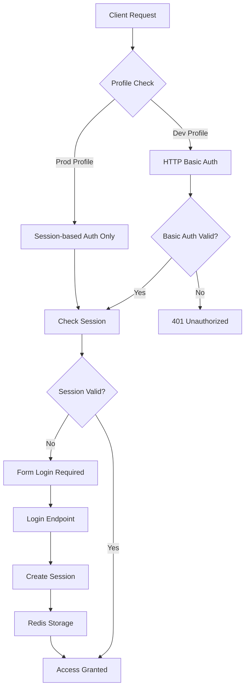
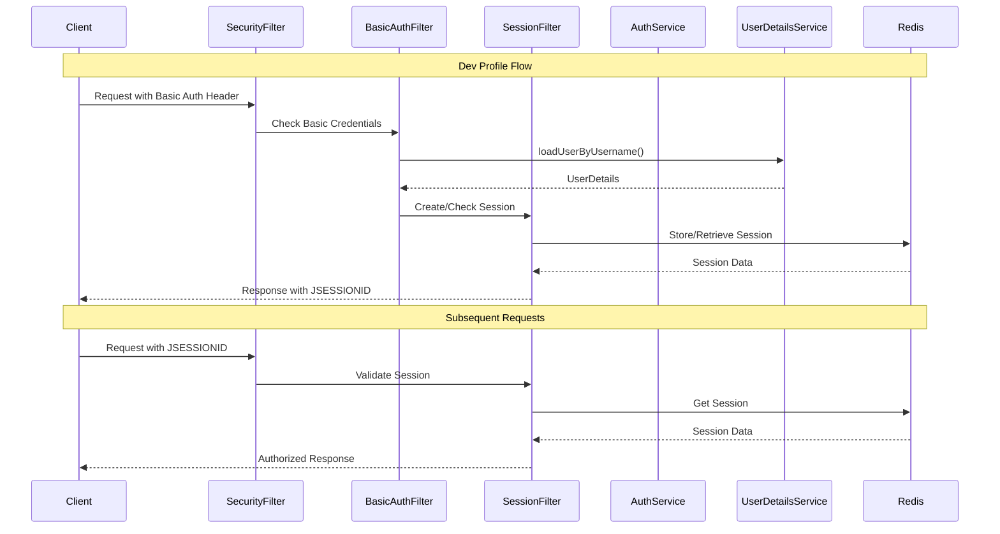

# 🔐 Board-Hole 인증 시스템 설계

## 📋 현재 인증 구조 분석

### 1. 인증 방식 (Multi-Layer Authentication)

현재 시스템은 **이중 인증 체계**를 구현하고 있습니다:



### 2. 프로필별 인증 설정

#### 🔵 **개발 환경 (dev profile)**
- **HTTP Basic 인증**: 활성화 ✅
- **세션 기반 인증**: 활성화 ✅
- **특징**: 개발 편의를 위한 이중 인증 지원

#### 🔴 **운영 환경 (prod profile)**
- **HTTP Basic 인증**: 비활성화 ❌
- **세션 기반 인증**: 활성화 ✅
- **특징**: 보안 강화를 위한 세션 전용

### 3. 인증 플로우 상세



## 🔍 현재 설정 검토

### ✅ 올바르게 구현된 부분

1. **프로필 기반 조건부 설정**
   ```java
   if (environment.acceptsProfiles(Profiles.of("dev"))) {
       http.httpBasic(Customizer.withDefaults());
   } else {
       http.httpBasic(AbstractHttpConfigurer::disable);
   }
   ```

2. **세션 관리**
   - Redis 기반 분산 세션 저장소 ✅
   - 세션 고정 공격 방어 ✅
   - 동시 세션 제한 ✅

3. **보안 헤더 설정**
   - CSRF 비활성화 (SPA 환경)
   - CORS 설정
   - Security Headers 자동 적용

### ⚠️ 개선이 필요한 부분

1. **HTTP Basic 인증 보안**
   - 현재: 기본 설정 사용
   - 권장: Realm 이름 커스터마이징

2. **인증 실패 처리**
   - 현재: 500 에러 발생 (테스트 시)
   - 필요: 적절한 에러 핸들링

3. **세션 타임아웃 정책**
   - 현재: 30분 고정
   - 권장: 프로필별 차별화

## 🛠 권장 개선사항

### 1. HTTP Basic Auth Realm 설정

```java
@Configuration
public class BasicAuthConfig {
    
    @Bean
    @Profile("dev")
    public SecurityFilterChain devSecurityFilterChain(HttpSecurity http) throws Exception {
        return http
            .httpBasic(basic -> basic
                .realmName("Board-Hole Dev API")
                .authenticationEntryPoint((request, response, authException) -> {
                    response.addHeader("WWW-Authenticate", "Basic realm=\"Board-Hole Dev API\"");
                    response.setStatus(HttpServletResponse.SC_UNAUTHORIZED);
                    response.getWriter().write("HTTP Basic Authentication required for dev profile");
                })
            )
            .build();
    }
}
```

### 2. 인증 방식 문서화

```java
/**
 * 인증 방식:
 * 
 * 1. 개발 환경 (dev):
 *    - HTTP Basic Auth: Authorization: Basic base64(username:password)
 *    - Session Auth: JSESSIONID cookie
 *    - 둘 중 하나만 있어도 인증 가능
 * 
 * 2. 운영 환경 (prod):
 *    - Session Auth only: JSESSIONID cookie
 *    - HTTP Basic Auth 완전 비활성화
 */
```

### 3. 통합 테스트 추가

```java
@SpringBootTest
@AutoConfigureMockMvc
class AuthenticationIntegrationTest {
    
    @Test
    @ActiveProfiles("dev")
    void testBasicAuthInDev() {
        // HTTP Basic Auth 테스트
    }
    
    @Test
    @ActiveProfiles("prod")
    void testBasicAuthDisabledInProd() {
        // HTTP Basic Auth 비활성화 확인
    }
    
    @Test
    void testSessionAuth() {
        // 세션 기반 인증 테스트
    }
}
```

### 4. 환경별 설정 최적화

```yaml
# application-dev.yml
spring:
  security:
    sessions:
      timeout: 2h  # 개발환경: 2시간
    basic:
      enabled: true
      realm: "Board-Hole Dev API"

# application-prod.yml  
spring:
  security:
    sessions:
      timeout: 30m  # 운영환경: 30분
    basic:
      enabled: false
```

## 📊 인증 방식 비교

| 특성 | HTTP Basic (Dev Only) | Session-based (All) |
|------|----------------------|---------------------|
| **전송 방식** | Authorization Header | Cookie (JSESSIONID) |
| **상태 유지** | Stateless | Stateful (Redis) |
| **매 요청 인증** | Yes | No (세션 확인만) |
| **보안 수준** | 낮음 (개발용) | 높음 |
| **사용 편의성** | 높음 (툴 지원) | 중간 (로그인 필요) |
| **분산 환경** | 자동 지원 | Redis 필요 |

## 🔒 보안 권장사항

1. **운영 환경에서는 절대 HTTP Basic 활성화 금지**
2. **HTTPS 필수 사용** (특히 Basic Auth 사용 시)
3. **세션 타임아웃 적절히 설정**
4. **Rate Limiting 추가 고려**
5. **감사 로깅 구현**

## ✅ 검증 결과

현재 인증 시스템은 **기본적으로 올바르게 구성**되어 있습니다:

- ✅ 개발 환경에서만 HTTP Basic 인증 활성화
- ✅ 운영 환경에서는 세션 기반 인증만 사용
- ✅ Redis를 통한 분산 세션 관리
- ✅ 적절한 보안 헤더 설정

다만, 위에서 제안한 개선사항들을 적용하면 더욱 견고한 인증 시스템이 될 것입니다.